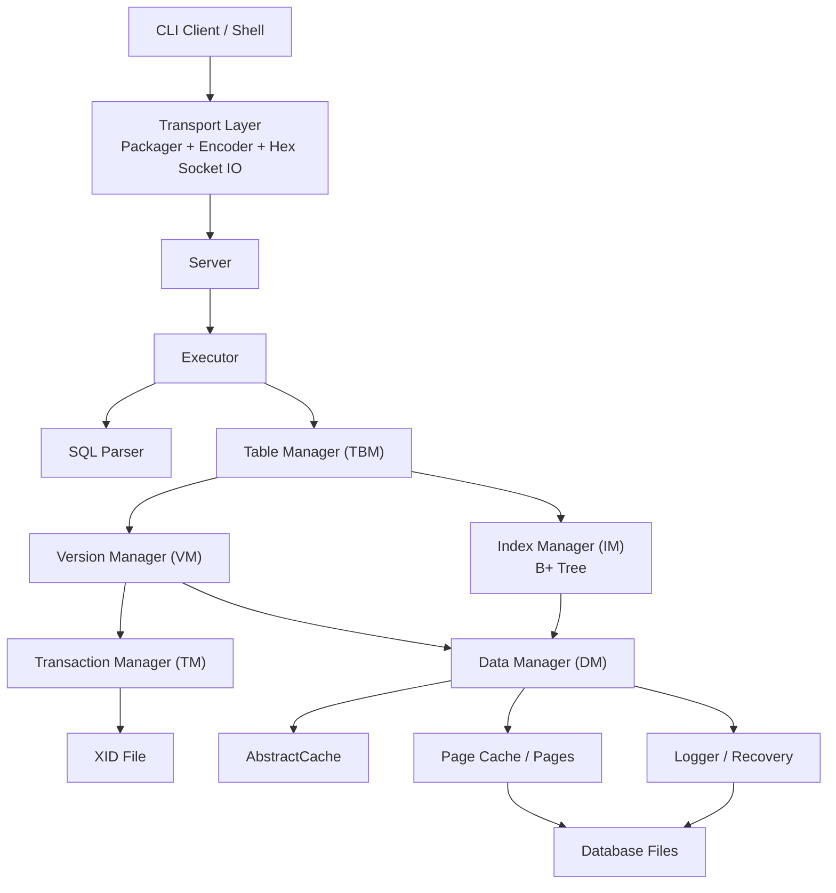
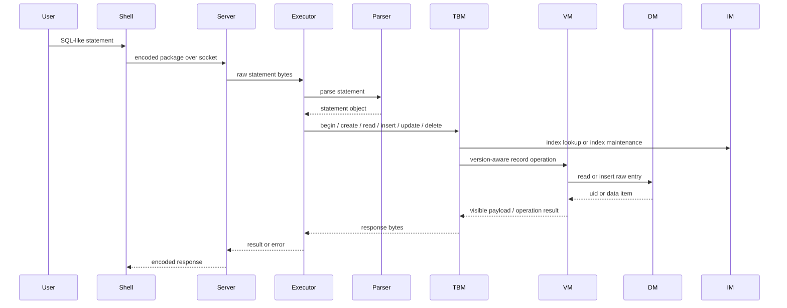

# Java MiniDB

Java MiniDB is an educational relational database implementation written in Java. It is inspired by MySQL-style storage architecture and separates the system into transaction, data, version, index, table, parser, transport, and client/server layers.

The project is best read as a systems programming and database internals exercise, not as a production-ready database. Several core ideas are implemented in code, while some persistence and recovery paths are still incomplete and are called out explicitly below.

## Project Overview

This repository explores how a small database can be built from lower-level components:

- persistent transaction state tracking through an XID file
- page-based storage with cached page/data-item abstractions
- write-ahead-log record formats for insert and update operations
- MVCC-style visibility checks for Read Committed and Repeatable Read
- row-level delete/update conflict handling through a lock table
- B+ tree index pages backed by the database storage layer
- a small SQL-like parser and TCP client/server shell

The implementation avoids ORMs, embedded databases, and large application frameworks so the database mechanics remain visible in the source.

## Key Features

- Java 17 Maven project with a compact, modular package layout.
- Transaction IDs and transaction status persisted in `.xid` files.
- Page and data-item abstractions for storing binary records.
- Reference-counted cache abstraction used by page, data-item, and version layers.
- MVCC entry format with `xmin`, `xmax`, and user payload.
- Visibility rules for Read Committed and Repeatable Read.
- Lock table with wait graph based deadlock detection.
- B+ tree index implementation with leaf/internal nodes, sibling links, range search, insertion, splitting, and root updates.
- Table metadata and field metadata persisted through the same VM/DM path.
- SQL-like parser for `begin`, `commit`, `abort`, `show`, `create`, `select`, `insert`, `delete`, and `update`.
- Simple socket protocol using package encoding and hex transport.

## Architecture



## Core Components

### Transaction Manager (TM)

Located in `src/main/java/top/risha/minidb/backend/tm`.

TM manages transaction IDs and persists transaction states in a `.xid` file. The XID file uses an 8-byte header for the transaction counter and 1 byte per transaction status:

- active
- committed
- aborted

The current implementation includes transaction creation, commit/abort persistence, status checks, and XID file validation.

### Data Manager (DM)

Located in `src/main/java/top/risha/minidb/backend/dm`.

DM owns the page/data-item storage abstraction. Data items are encoded as:

```text
[ValidFlag] [DataSize] [Data]
```

DM also coordinates page selection, insertion/update logging, page-one open/close validation, and recovery entry points. The implementation includes page cache, page index, logger, and recovery modules.

### Version Manager (VM)

Located in `src/main/java/top/risha/minidb/backend/vm`.

VM wraps stored records in MVCC entries:

```text
[XMIN] [XMAX] [DATA]
```

It provides version-aware `read`, `insert`, and `delete`, and maintains active transactions. It also integrates with `LockTable` to detect conflicting deletes/updates and deadlocks. Visibility rules are implemented for:

- Read Committed
- Repeatable Read using a transaction snapshot

VM commit removes in-memory transaction state, releases locks, and persists the committed transaction status through TM.

### Index Manager (IM)

Located in `src/main/java/top/risha/minidb/backend/im`.

IM implements a B+ tree backed by DM data items. Nodes are encoded as:

```text
[LeafFlag] [KeyNumber] [SiblingUid] [Son0] [Key0] ... [SonN] [KeyN]
```

Implemented behavior includes:

- root creation and root UID persistence
- loading nodes from DM
- exact-key search through range search
- range search across leaf sibling chains
- insertion into leaf/internal nodes
- node splitting
- root replacement after split

### Table Manager (TBM)

Located in `src/main/java/top/risha/minidb/backend/tbm`.

TBM is the relational layer. It manages table metadata, field metadata, indexed fields, and statement execution against tables.

Supported table field types:

- `int32`
- `int64`
- `string`

Tables and fields are persisted as VM records. Indexed fields create B+ trees. `select`, `update`, and `delete` use indexed fields for lookup; non-indexed `where` fields are rejected.

### Client/Server Communication

Located in:

- `src/main/java/top/risha/minidb/backend/server`
- `src/main/java/top/risha/minidb/client`
- `src/main/java/top/risha/minidb/transport`

The server listens on port `9999`. The client opens a socket to `127.0.0.1:9999`, reads statements from stdin, and sends them to the server.

The transport layer uses:

- `Package` for data/error payloads
- `Encoder` for success/error framing
- `Transporter` for hex-encoded line-based socket IO
- `Packager` for send/receive composition

This is a custom educational protocol, not the MySQL wire protocol and not JDBC.

## Database Concepts Implemented

| Concept | Status | Notes |
| --- | --- | --- |
| Transactions | Implemented core | XID allocation, active/committed/aborted status persistence, and transaction lifecycle integration exist. |
| MVCC | Implemented core | Entries store `xmin`/`xmax`; visibility rules for RC/RR are implemented. |
| 2PL / locking | Partial | Delete/update paths acquire UID-level locks through `LockTable`; deadlock detection uses a wait graph. This is not a full SQL lock manager. |
| Crash recovery / logging | Implemented core | Insert/update log formats, checksummed logger records, bad-tail removal, and REDO/UNDO recovery flow are present. More crash scenario tests are needed. |
| Page cache | Implemented core | Reference-counted cache abstraction and file-backed page cache operations are implemented. |
| B+ tree indexing | Implemented core | Search, range scan, insert, split, sibling links, and root updates are implemented. Deletion/rebalancing is not implemented. |
| SQL parsing | Implemented subset | Parser handles a small SQL-like grammar for basic DDL/DML and transaction statements. It is not a full SQL parser. |

## Request Execution Flow



## Project Structure

```text
src/main/java/top/risha/minidb
+-- backend
|   +-- common      # shared cache and byte-array helpers
|   +-- dm          # data manager, pages, logging, recovery
|   +-- im          # B+ tree index manager
|   +-- parse       # SQL-like tokenizer and parser
|   +-- server      # TCP server and statement executor
|   +-- tbm         # table and field metadata/execution layer
|   +-- tm          # transaction status manager
|   +-- utils       # binary parsing and utility helpers
|   +-- vm          # MVCC/version manager and lock table
+-- client          # CLI shell and client round trip logic
+-- common          # shared error definitions
+-- transport       # package encoding and socket transport
```

## Build and Run

Prerequisites:

- JDK 17
- Maven

Build command:

```bash
mvn package
```

Current build status:

```text
mvn -q package
```


Run with Maven:

```bash
# Create a database
mvn -q exec:java -Dexec.mainClass=top.risha.minidb.backend.Launcher -Dexec.args="-create /tmp/minidb"

# Open the server with an optional memory limit
mvn -q exec:java -Dexec.mainClass=top.risha.minidb.backend.Launcher -Dexec.args="-open /tmp/minidb -mem 64MB"

# Start the client shell in another terminal
mvn -q exec:java -Dexec.mainClass=top.risha.minidb.client.Launcher
```

The server listens on `127.0.0.1:9999`.

## Example SQL Usage

The parser supports a small SQL-like grammar. Example statements:

```sql
begin
begin isolation level repeatable read

create table user id int64, name string, age int32 (index id age)

insert into user values 1 "Alice" 24
insert into user values 2 "Bob" 31

select * from user where id = 1
select id, name from user where age > 20

update user set age = 25 where id = 1
delete from user where id = 2

show
commit
abort
```


